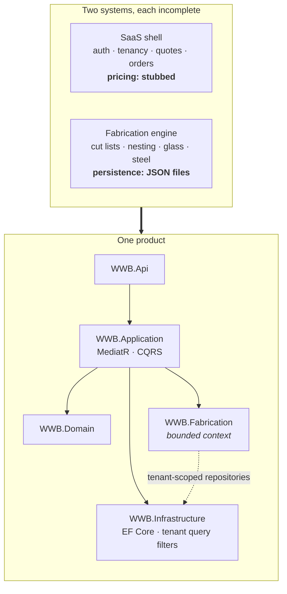

# Windoor Wizard Builder

**A vertical SaaS with a fabrication engine that had to be exactly right**

> **Published at `/work/windoor-wizard-builder`.** That page is what readers see and is
> the version to edit; this file is the portable copy, kept for reading outside the site
> and for pasting elsewhere. They will drift — reconcile them if this one is ever revised.

Egyptian UPVC window and door workshops run on WhatsApp, Excel, and paper. Quotes are priced by hand. Cut lists are worked out per job. The profile offcuts that decide whether a job is profitable are estimated rather than calculated.

Generic ERP software does not help, because it does not model the domain. It has no concept of a frame deduction registry, of bar nesting, or of the glass area and steel reinforcement that drive the real cost of a window. A workshop using generic software still does the hard part on paper.

WWB is the software that replaces the paper. It is two halves — a commercial SaaS shell and a fabrication engine — built separately and then merged into one product.

---

## 1. The decision that shaped everything: exact arithmetic

The single most consequential design decision in this system is how a length is stored.

The obvious choice is `decimal` millimetres. It is wrong, and the reason is not theoretical.

The shop cuts half-millimetres. In 195 verified rows taken from real orders, **44 contained a half-millimetre cut** — 483.5mm, not 483mm and not 484mm. A cut list that rounds is a cut list that produces a window that does not fit, and the error is discovered after the profile has been cut.

So lengths are stored as **exact integer tenths of a millimetre**:

```csharp
/// <summary>
/// Lengths are exact integer TENTHS of a millimetre. The shop cuts half-millimetres
/// (44 of 195 verified rows, e.g. 483.5mm), so integer mm cannot represent every cut;
/// tenths keep exactness with no floating-point drift. 483.5mm == 4835 tenths.
///
/// There is deliberately NO decimal factory: every length in the model originates as
/// whole millimetres (openings, deltas) or as the exact result of integer tenths
/// arithmetic. A decimal entry point would invite rounding (Math.Round(483.5) == 484),
/// destroying the very half-millimetre this type exists to preserve.
/// </summary>
public readonly record struct Millimetres
{
    public int Tenths { get; }

    public static Millimetres FromTenths(int tenths) => new(tenths);
    public static Millimetres FromMm(int wholeMillimetres) => new(wholeMillimetres * 10);

    /// <summary>Exact decimal mm for display only — never for further integer math.</summary>
    public decimal ToMm() => Tenths / 10m;
}
```

The part worth pausing on is the **absence** of a `FromDecimal` factory.

Every length in the model either originates as whole millimetres — an opening measurement, a seed delta — or as the exact result of integer arithmetic on tenths. There is no legitimate path from a decimal into the model. Providing one would create an entry point through which `Math.Round(483.5m)` could reach the domain and silently destroy the exact half-millimetre the type exists to preserve.

This is a case where the right design was to make the wrong thing *unrepresentable* rather than to document it as discouraged. A comment saying "don't round here" is advice. A missing constructor is a guarantee.

---

## 2. Bar nesting: a bin-packing problem with a saw

A window frame is cut from stock bars of fixed length. Cutting the pieces for an order in the wrong arrangement wastes profile, and profile is the dominant material cost. Deciding how to lay pieces onto bars is a **one-dimensional bin-packing problem**, which is NP-hard, so the engine uses First-Fit-Decreasing — a well-understood heuristic with a known worst-case bound.

Three details separate the real implementation from the textbook version.

```csharp
public Result<NestingResult> Nest(IReadOnlyList<Millimetres> pieces, NestingConstants c)
{
    var usableTenths = (c.BarLengthMm - c.BarEndTrimMm) * 10;
    var kerfTenths = c.SawKerfMm * 10;

    foreach (var piece in pieces)
    {
        if (piece.Tenths > usableTenths)
        {
            return Result<NestingResult>.Fail(
                $"Piece {piece.ToMm()}mm exceeds the usable bar length … and cannot be " +
                "cut from a single bar (BR-5).");
        }
    }

    // Stable descending sort: ties keep their original relative order, so packing is
    // deterministic across repeated calls with the same input.
    var sorted = pieces.OrderByDescending(p => p.Tenths).ToList();

    foreach (var piece in sorted)
    {
        var placedIndex = -1;
        for (var i = 0; i < remainingTenths.Count; i++)
        {
            if (piece.Tenths + kerfTenths <= remainingTenths[i])
            {
                placedIndex = i;
                break;
            }
        }
        …
        remainingTenths[placedIndex] -= piece.Tenths + kerfTenths;
    }
}
```

**The saw has width.** Every cut consumes kerf. A packer that ignores it produces arrangements that fit on paper and fail on the machine — the last piece on each bar comes up short by a few millimetres per cut. The kerf is added to every placement, not to the bar total, because it is consumed per cut rather than once.

**It fails loudly rather than degrading.** A piece longer than a usable bar can never be cut, regardless of how the rest are arranged. Returning a "best effort" arrangement here would hand the shop floor a cut list that cannot be executed. The operation returns a failure with the offending measurement named.

**Packing is deterministic.** The sort is stable, so ties keep their input order. Two runs over the same order produce byte-identical cut lists. This matters more than it looks: a cut list is printed, taken to the machine, and cross-checked against the order. A packing that reshuffled between runs would make that check meaningless.

**Nothing is hardcoded.** Bar length, end trim, saw kerf, and the minimum reusable offcut all arrive through `NestingConstants`, supplied by the caller. A different workshop with a different saw is a configuration change, not a code change — which is the difference between software for one shop and a product.

---

## 3. Merging two systems into one bounded context

The two halves were built separately and each lacked what the other had.

The SaaS shell had authentication, multi-tenancy, customers, quotes, orders, a production board, and Arabic RTL PDF output — but its pricing engine was **hollow**. The quote calculation was stubbed. The commercially valuable part of the product did not exist.

The fabrication engine *was* that missing calculation, verified against real orders from a working shop — but it had no tenancy, no persistence beyond JSON files, and no commercial surface.



The engine became a **`WWB.Fabrication` bounded context** inside the SaaS rather than a service alongside it. That choice is worth defending: the fabrication calculations are always performed in the context of a quote belonging to a tenant, they share that transaction, and they have no independent lifecycle. Splitting them across a network boundary would have bought distribution overhead and bought nothing back.

Multi-tenancy is enforced through **EF Core global query filters on `TenantId`**, not through a `WHERE` clause that each query is expected to remember. Tenant isolation implemented as a convention fails the first time somebody forgets; implemented as a query filter, forgetting is not possible. For a system holding one workshop's pricing and customer list against its competitors', that distinction is the whole security model.

---

## 4. Verification against reality, not against assumptions

The engine is **oracle-verified**: its output is checked against real orders from a working workshop, not against expectations derived from the same understanding that produced the code. A calculation engine validated only against its author's mental model is a mental model with tests.

The merged solution carries **491 passing unit tests** across domain, application, API, and infrastructure layers.

One finding from the merge is worth recording because of how it was treated. After restructuring, 72 tests failed — all of them value assertions against the SaaS's stubbed pricing service (`expectedMultiplier: 1.6`, `expectedAddition: 50`). None were "type not found" errors, which is what a bad copy produces. These failures were **pre-existing and diagnostic**: they are a specification of exactly which multipliers the real engine must satisfy once wired in. They were left failing and documented as the acceptance criteria for the integration phase, rather than deleted to make the suite green.

---

## 5. Stack

| Layer | Choice |
|---|---|
| Backend | .NET 10, Clean Architecture (Domain / Application / Infrastructure / Api) |
| Application | MediatR, CQRS |
| Persistence | EF Core, multi-tenant via `TenantId` global query filters |
| Auth | JWT |
| Documents | QuestPDF, Arabic right-to-left |
| Frontend | Angular 18 — standalone components, OnPush, NgRx Signals, Arabic RTL |
| Orchestration | .NET Aspire (AppHost + ServiceDefaults) |

---

## What this project demonstrates

Domain modelling where correctness is physical rather than notional — a rounding error becomes a mis-cut profile. Choosing a known heuristic for an NP-hard problem and then handling the three practical details (kerf, unpackable input, determinism) that separate a working implementation from a textbook one. Deciding a bounded-context boundary on the basis of transaction and lifecycle rather than fashion. Enforcing a security property structurally instead of by convention. And treating failing tests as a specification when that is what they actually are.
